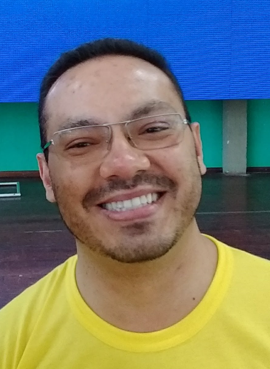

# Paulo Roberto Alves Pereira

Local: Maringá - Paraná | Idade: 43 anos

e-mail: [rappaulo@gmail.com](rappaulo@gmail.com)

Site: [http://www.pprogrammer.com.br](http://www.pprogrammer.com.br "Meu site pessoal")

LinkedIn: [http://www.linkedin.com/in/pprogrammer](http://www.linkedin.com/in/pprogrammer "pprogrammer no LinkedIn")

GitHub: [https://github.com/pprogrammer](https://github.com/pprogrammer "pprogrammer no GitHub")

Twitter: [@pprogrammer](http://twitter.com/pprogrammer "pprogrammer no Twitter")

Instagram: [pprogrammer](http://instagram.com/pprogrammer "pprogrammer no Instagram")

Blog: [https://programmerblogging.wordpress.com/](https://programmerblogging.wordpress.com/ "Meu blog pessoal - Refatorando ideias e Hackeando a vida")

## Formação

* Engenharia de Software pela UniCesumar, 2015-2018 (cursando).

## Idiomas

* Português : Fluente/Nativo
* Inglês : Intermediário

## Atividades Profissionais

* Programador no Grupo Prever em Maringá-PR. (Janeiro/2012 - atualmente):
  Sou responsável pelo desenvolvimento e manutenção do sistema mobile de cobrança (em Android nativo) e sua integração com o sistema corporativo (em Delphi e SQL Server). Também faço a manutenção em diversos sistemas do grupo e a implementação de novas funcionalidades, realizando também a análise de requisitos e todo processo de validação e acompanhamento com os usuários solicitantes. Realizei a integração de NFS-e com as prefeituras de diversas cidades onde possuímos filiais, e também a integração dos sistemas internos com sistemas de terceiros através de APIs SOAP e RESTful.

* Analista/Desenvolvedor e Consultor externo na Gold System em São José do Rio Preto-SP (2004 - 2011):
  Atuei como analista e desenvolvedor de um aplicativo para gerenciamento de recebimento e cobrança para empresas do segmento funerário que trabalham com Planos Assistenciais (Funerários) e pagamento recorrente (mensalidades). O aplicativo era composto de uma versão desktop (que se integrava ao sistema principal para obter e atualizar dados) e uma versão mobile, inicialmente desenvolvida para Palm OS, depois para Windows Mobile e posteriormente para  Android. Desenvolvi e implantei um sistema de controle de protocolos em PDAs Palm OS (e um App desktop) para um escritório de contabilidade, auxiliando no gerenciamento do processo de entrega de documentos aos clientes do mesmo. Também atuei como consultor externo, atendendo pessoalmente diversas empresas clientes (em várias cidades e estados), auxiliando no levantamento de requisitos e definição de necessidades específicas, adaptações e ajustes nos sistemas de controle de Planos e Financeiro da Gold System. Ainda atuei na seleção e orientação de desenvolvedores para o desenvolvimento de uma versão WEB do sistema de Planos.

* Consultor/Desenvolvedor para VCE em São José do Rio Preto-SP (2010 - 2011):
  Atuei como consultor de desenvolvimento para um sistema de gerenciamento de documentos e implantação de qualidade. O sistema foi desenvolvido em Delphi com multicamadas, tendo servidores de aplicação acessando MS SQL Server, Firebird e Oracle. Também realizei a implantação de versionamento de código utilizando Subversion e a virtualização de ambiente de testes para prospectos utilizando o VMWare Server e o treinamento dos programadores.

* Consultor de desenvolvimento em Delphi na Microlins Franchising em São José do Rio Preto-SP:
  Atuei na orientação e seleção (criando e aplicando avaliação) da equipe de desenvolvimento que realizava a manutenção do software utilizado pelos franqueados da Microlins e também no consolidador de dados das franquias. Também atuei como desenvolvedor senior, codificando partes criticas, procurando otimizar o desempenho e aumentar a robustez do software.

* Analista/Desenvolvedor de sistemas na KODILAR em São José do Rio Preto-SP/São Paulo-SP (2005 - 2010):
  Desenvolvi um sistema integrado para Controle de Clientes e Fornecedores, Faturamento e emissão de Notas, Contas a Pagar e Contas a Receber, Financeiro, Integração Bancária, etc, que substituiu o sistema anterior da empresa (em Cobol). Também realizei a migração de parte dos dados do sistema anterior e o desenvolvimento de um módulo para Automação de Força de Vendas (utilizando PDAs Palm OS e impressoras térmicas portáteis). Através da utilização dos PDAs tivemos uma otimização de todo processo de digitação de pedidos, verificações financeiras e de estoque e emissão de notas. Os pedidos que anteriormente eram enviados por fax e que geravam altos índices de retrabalho e horas extras para atender a demanda foi substituida pelo uso de PDAs e transmissão por celular. Com a importação  automatica dos pedidos, bloqueios por pendencias com financeiro, indicações quanto a estoque insuficiente, e alguns outros controles automáticos, possibilitou a eliminação de horas extras realizadas pelo departamento, alem de permitir a redução do quadro utilizado (realocando ou dispensando pessoas), uma vez que uma única pessoa conseguia realizar todo processo de faturamento que anteriormente demandava 4 ou 5 pessoas.

* Analista/Desenvolvedor de ERP na Bionatus em São José do Rio Preto-SP/São Paulo-SP (1999 - 2009):
  Desenvolvimento de um sistema integrado para a fábrica (em Rio Preto) e também para central de distribuição (em São Paulo), gerenciando Clientes e Fornecedores, Produtos e Estoque, Contas a Pagar e a Receber, Faturamento e Notas Fiscais (com priorização de Lotes/Validade), Financeiro, Integração Bancária, Integração com Sistemas Contábeis, SAC e também um módulo para Controle Agropecuário (uma outra empresa do grupo).

* Instrutor de Programação na PROANSI em São José do Rio Preto-SP:
  Fui responsável por formular conteúdo, apostilas e ministrar cursos em diversas linguagens e ferramentas de programação (Visual FoxPro, Delphi, Visual Basic, Java, PHP, C/C++ com GTK e Qt em Linux), sistemas operacionais (Windows NT, Linux e FreeBSD) e bancos de dados (SyBase, SQL Server, Oracle, PostgreSQL e Interbase/Firebird).

* Instrutor de Programação na Icone Byte em São José do Rio Preto-SP:
  Fui responsável por formular conteúdo, apostilas e ministrar cursos em Visual FoxPro, Delphi, C++, VBA (em Excel).

* Programador na MCT Informática em São José do Rio Preto-SP:
  Fui responsável por desenvolver sistemas integrados para industrias de diversos segmentos (textil, alimenticia, etc), comercio e de engenharia (cálculos para fundação), utilizando as linguagens Clipper, DBFast, FoxPro, Turbo Pascal e Turbo C. Também atuei ministrando treinamento de programação em Clipper junto ao SENAC de São José do Rio Preto-SP (através da MCT).

## Informações adicionais

* Sólida experiência prática no levantamento e validação de requisitos, no desenvolvimento de software para segmentos como industrias (Têxtil, Farmacêutica, Alimenticia, Química e Moveleira), Saúde (Clinicas Médicas e Hospitais), Educação (Escolas de Idiomas), e empresas do setor Funerário, de Engenharia, Imobiliarias e Escritorios de Advocacia, Consultorias. Treinamento de desenvolvedores e equipes para adoção de novas tecnologias, integração com softwares de Contabilidade e ERPs de terceiros, integração de NF-e/NFS-e, SPED, SUFRAMA e outras obrigações fiscais.

* Ao longo dos anos adiquiri experiencia e habilidades de desenvolvimento com:
  C/C++, Pascal, xBase (Clipper, FoxPro, Visual FoxPro), Delphi, VB, Java, PHP, C#, VB.NET, ASP/ASP.NET, Python, Ruby, HTML 5/CSS, Javascript e Bootstrap. Bancos de dados MS SQL Server, Oracle, Interbase/Firebird, MySQL, PostgreSQL, SQLite.

* No desenvolvimento de aplicativos móveis (nativo e Web Apps) já desenvolvi para as seguintes plataformas: Palm OS, Windows Mobile, Symbiam, Android, iOS e  Windows Phone.

* Uso de gerenciadores de versionamento de código fonte: CSV, Subversion, Team Source, Git (com GitHub e BitBucket).

* Sistemas operacionais (utilização e programação): DOS (3.0 ao 6.22), OS/2, Novell, Windows (3.0 ao 10), Linux (distros Slackware, RedHat, Conectiva, Kurumin, Slax, Debian, Ubuntu, Fedora), Unix (FreeBSD e OpenBSD) e OS X (Tiger a Sierra).

* IDEs, Ferramentas e conhecimentos extras:
  IDEs Delphi (desde 1.0) / RAD Studio, Eclipse, Android Studio, MS Visual Studio, PyCharm, Notepad++, SublimeText, Atom, MS Visual Code e Vim.
  Virtualização de ambientes para desenvolvimento e testes (VMWare e VirtualBox).

---

Para mais detalhes, visualize também meu perfil no [LinkedIn](http://www.linkedin.com/in/pprogrammer "Paulo no LinkedIn").

[email-me](https://mail.google.com/mail/u/0/?view=cm&fs=1&tf=1&to=rappaulo@gmail.com "Enviar email")!    =)
